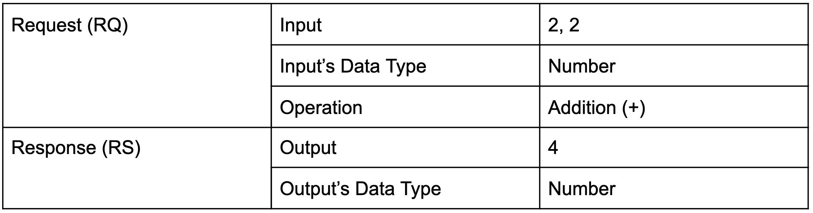
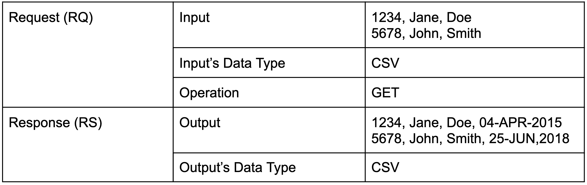

In [part 1](https://www.prostdev.com/post/understanding-apis-part-1-what-is-an-api) of this series, we learned what an API is and the 4 aspects that we can use to define it, which are Inputs, Operations, Outputs, and Data Types. We also outlined this nice diagram to have a visual representation:

In the [previous post (part 2)](https://www.prostdev.com/post/understanding-apis-part-2-api-analogies-and-examples), we described some analogies and examples to understand better how APIs can be applied in the real world. There was also a quiz for the second analogy (the calculator). The question was: *What would be the Data Types for the RQ and RS in this scenario?* The answer will be revealed throughout this post!

So far, we’ve been talking about the theory behind APIs, but we have to get our hands dirty at some point! Today we will be learning more about these HTTP methods and how they fit into our previously defined diagram.

## What exactly is an API?

API can mean a lot of things in the software development world, but I will be talking about the APIs that have been popular lately: the RESTful APIs or RESTful Web Services. These APIs are “calls” (the combination of Request and Response sent to and received from the API) that are made through [HTTP](https://en.wikipedia.org/wiki/Hypertext_Transfer_Protocol) (Hypertext Transfer Protocol).

To explain HTTP more simply, when you type “www.google.com” or “facebook.com” into your browser, and you press Enter, you’re communicating with a remote server via HTTP. You are sending a Request to a specific web address, and you are getting back a Response, which your browser shows visually (Google or Facebook’s website, in this case).

## Understanding the Operation

One of the 4 aspects that we previously defined was the Operation that is sent to the API in the Request. When we send a Request to an API, we have to specify what kind of action we want the API to perform with the data we are sending.

In our [previous post](https://www.prostdev.com/post/understanding-apis-part-2-api-analogies-and-examples), we explained the calculator analogy and the Human Resources API example. Let me refresh your memory a bit.

**Calculator analogy**

In this analogy, we selected the calculator to act as our “API body” or API Implementation. We sent two numbers (2 and 2), and the Operation, in this case, was a sum.

We got a result of 4 as the Output or Response. The calculator knows what to do with the numbers because we specify an Operation in the Request.

Breaking down the 4 aspects:

**Human Resources API**

In this more practical example, we wanted to retrieve the first day of employment from certain employees. The list of employees was sent inside a CSV file containing the Employee ID, First Name, and Last Name. The Operation we specified for the API was a “GET.”

This is what the Request looked like:

The Human Resources API then returned a new CSV file in which there was a new column called “First Day.” This contains the information we asked for in the Request, which was the employees’ first day of employment.

Breaking down the 4 aspects:

Now I’m sure you’re wondering why the Operation for this Human Resources API is just “GET.” Well, you’re about to figure it out!

## HTTP Methods

As I mentioned earlier, a RESTful API communicates through HTTP. To communicate through HTTP, you need to specify what Operation you want the server to perform. When you write “google.com” in your browser and press Enter, you’re actually performing a GET method when trying to call Google - you want to get or retrieve the main Google website. The server then returns some data as the Response. Your browser is able to translate that information into a visual, which is the Google website with images and animations. And this is exactly what you were expecting.

There are 9 HTTP methods: GET, HEAD, POST, PUT, DELETE, CONNECT, OPTIONS, TRACE, and PATCH. However, the most popular ones are GET, POST, PUT, PATCH, and DELETE.

> [!NOTE]
> There is A LOT of debate around the POST, PUT, and PATCH methods since they *can* be used to do “the same” kind of operations (create or update data). However, I will be based on the best practices shown by [Mozilla](https://developer.mozilla.org/en-US/docs/Web/HTTP/Methods) and [REST API Tutorial](https://www.restapitutorial.com/lessons/httpmethods.html).

**GET**

This method is used to read or retrieve data from the server or the API. We can see this in the Human Resources API example, when we wanted to retrieve the employees’ first day of employment. The information we sent in the Request was merely used to perform a search of the data, but no information was changed in the server.

**POST**

This method is used when you want to create new data. In the Human Resources API example, you would use POST to add a new employee.

POST is **not** an [idempotent](https://en.wikipedia.org/wiki/Idempotence) method, which means that sending the same information more than once can result in duplicated data. This is why it’s used for creation only.

**PUT**

This method is mostly used to update or replace existing data, but it can also be used to create new data. The difference with POST is that PUT **is** an [idempotent](https://en.wikipedia.org/wiki/Idempotence) method, which means that sending the same information more than once will have the same effect as sending it just once. We’ll talk more about these differences in the following posts.

**PATCH**

This method is used to update or modify *parts* of the existing data. An example of this would be updating only the first name of an employee because there was a typo. PATCH *can* be an [idempotent](https://en.wikipedia.org/wiki/Idempotence) method, depending on how the API Implementation works. We’ll talk more about the differences between PUT and PATCH when we discuss updating data in the next posts.

**DELETE**

This is the easiest method to understand. This method is used to delete data, such as deleting an employee in the HR analogy.

## Recap

- The answer to the quiz from the previous post (*What would be the Data Types for the RQ and RS in this scenario?)* is “Number.”
- RESTful APIs or RESTful Web Services are calls that are made through HTTP (Hypertext Transfer Protocol).
- There are 9 HTTP methods: GET, HEAD, POST, PUT, DELETE, CONNECT, OPTIONS, TRACE, and PATCH. However, the most popular ones are GET, POST, PUT, PATCH, and DELETE.
- GET is used to retrieve data.
- POST is used to create new data and is not an idempotent method (or unsafe).
- PUT is mostly used to update or replace existing data but can also be used to create new data. It is an idempotent (safe) method.
- PATCH is used to update or modify parts of the existing data and *can* be an idempotent method.
- DELETE is used to delete data.

As I’ve been saying throughout these posts, we’re absorbing information piece by piece. It’s ok if you’re still confused about what it all means or how it all fits together. We’ll get there; I promise.

Just don’t give up!

*Prost!*

-Alex
