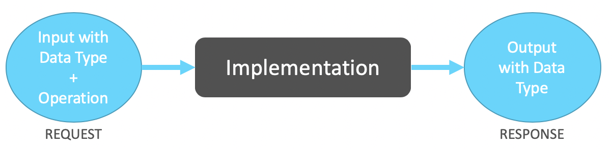
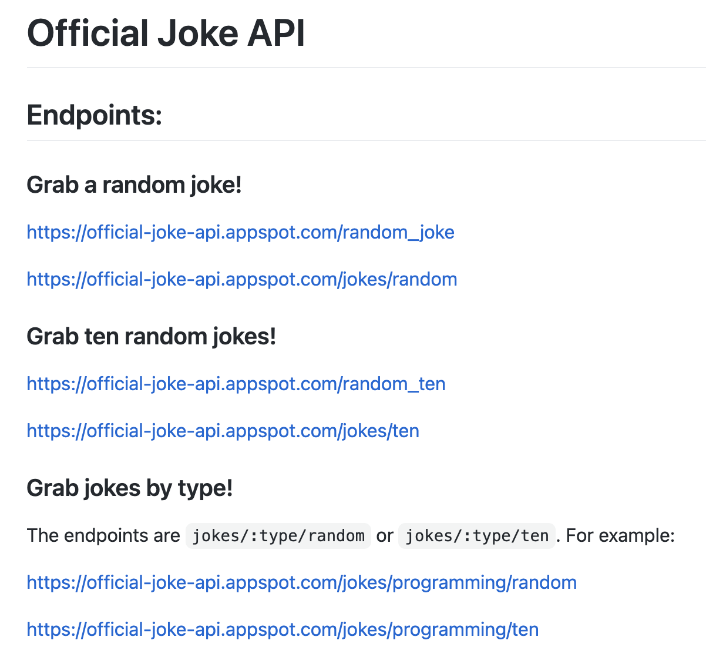
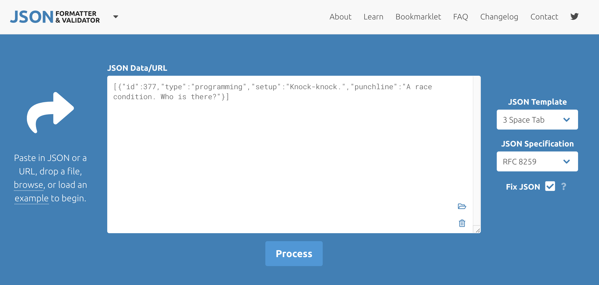
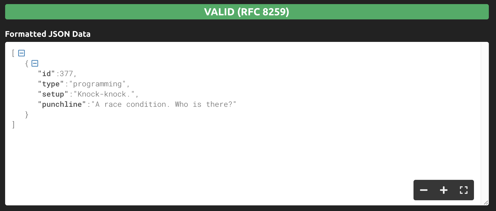
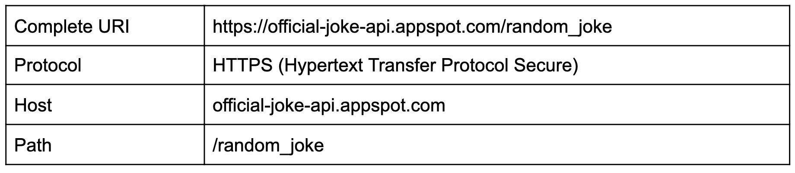
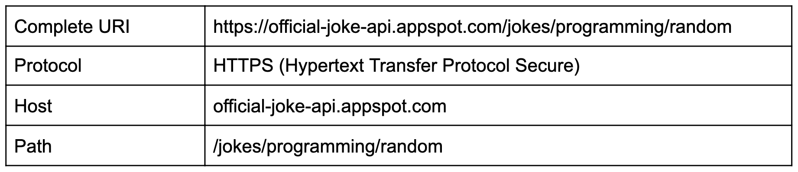

We are slowly starting to get a sense of what an API is. So far, we’ve been learning, piece by piece, some of the components that define an API. Let’s take a look back at what we’ve learned:

- [Understanding APIs (Part 1): What is an API?](https://www.prostdev.com/post/understanding-apis-part-1-what-is-an-api) - We defined the 4 aspects: Inputs, Operations, Outputs, and Data Types. We also explained what an API’s Request and Response is. Finally, we put all this together in a diagram.
- [Understanding APIs (Part 2): API Analogies and Examples](https://www.prostdev.com/post/understanding-apis-part-2-api-analogies-and-examples) - To get a better grasp, we talked about the Restaurant and Calculator analogies. Then, we defined the Human Resources API example using the CSV and JSON Data Types.
- [Understanding APIs (Part 3): What are HTTP Methods?](https://www.prostdev.com/post/understanding-apis-part-3-what-are-http-methods) - We started getting technical and learned about the 5 most popular HTTP methods used by RESTful APIs: GET, POST, PUT, PATCH, and DELETE.



*Diagram defined in Part 1, which contains the 4 aspects of the API + the Implementation.*

For this post, we will learn what a URL and a URI really are and how this fits in our previously defined diagram.

## What is a URL?

In the previous post, we learned that RESTful APIs or RESTful Web Services are calls that are made through [HTTP](https://en.wikipedia.org/wiki/Hypertext_Transfer_Protocol) (Hypertext Transfer Protocol).

When you’re using a telephone to make a call, you need to know the telephone number to dial. When you want to make a call using HTTP, you need to know the web address instead of the telephone number. This web address is known as a [URL](https://en.wikipedia.org/wiki/URL#:~:text=A%20typical%20URL%20could%20have,and%20a%20file%20name%20(%20index.) (Uniform Resource Locator). E.g. [https://www.google.com](https://www.google.com/).

URLs are mostly used to retrieve websites or web pages from the internet (using [HTTP](https://en.wikipedia.org/wiki/Hypertext_Transfer_Protocol)) such as Google or Facebook. But URLs can also be used for File Transfer (through [FTP](https://en.wikipedia.org/wiki/File_Transfer_Protocol)), database access (using [JDBC](https://en.wikipedia.org/wiki/Java_Database_Connectivity)), and many others.

## What is a URI?

From Wikipedia: “The most common form of URI is the Uniform Resource Locator (URL), frequently referred to informally as a web address.”

Actually, a [URL](https://en.wikipedia.org/wiki/URL#:~:text=A%20typical%20URL%20could%20have,and%20a%20file%20name%20(%20index.) is just a form of [URI](https://en.wikipedia.org/wiki/Uniform_Resource_Identifier) (Uniform Resource Identifier). A lot of people use both terms to refer to the same thing in the API world. For the sake of this post, let’s just say that a URL is mostly used for visual websites, and we’ll be using URIs to call our APIs. E.g. [https://api.twitter.com/2/tweets/:id](https://api.twitter.com/2/tweets/:id).

## Example: Joke API

I went ahead and googled some public APIs that I could use as examples, and I found this [Joke API](https://github.com/15Dkatz/official_joke_api) that, when called, returns with a joke in JSON format.



*Official Joke API documentation is taken from the* [README.md](https://github.com/15Dkatz/official_joke_api/blob/master/README.md) *file.*

Since these are all using GET as the HTTP method, you can open these links directly from your browser (or just click on them).

Let’s check out the first option, which is to grab a random joke: [https://official-joke-api.appspot.com/random_joke](https://official-joke-api.appspot.com/random_joke)

This is what I get in my browser after clicking or inputting the link:

```json
{"id":131,"type":"general","setup":"How do you organize a space party?","punchline":"You planet."}
```

It may be a bit hard to read if you’re not familiar with the JSON syntax, but it basically returned a setup that says, “How do you organize a space party?” and the punchline is “You planet.”

Let’s try now to retrieve a random programming joke: [https://official-joke-api.appspot.com/jokes/programming/random](https://official-joke-api.appspot.com/jokes/programming/random)

Now I got this as the Response:

```json
[{"id":377,"type":"programming","setup":"Knock-knock.","punchline":"A race condition. Who is there?"}]
```

Let me show you a trick to be able to format a JSON into something more human-readable. Go to [this JSON formatter website](https://jsonformatter.curiousconcept.com/) and paste your JSON data into the text box.



Then just click on “Process,” and you will get something like this:



Isn’t it more human-readable now?

P.S. I didn’t get the joke. :(

## Breaking down a URI

Let’s break down the two URIs we just called: the random joke and the random programming joke.

**Random joke**



**Random programming joke**



As we can see here, the HTTP or HTTPS protocols will be used when using RESTful APIs. HTTPS is just a secure way to call HTTP.

The host is the URI part that remains the same even when you change the path you’re using to retrieve different information. Just like how “google.com” doesn’t change even after searching for something.

Those two were kind of straightforward to break down, but in the following post, we will learn about Query Parameters and start using a great tool called Postman. With it, you will be able to call your APIs and see the responses in a more human-readable way without using the browser or the JSON formatter tool.

## Recap

- A **URL** (Uniform Resource Locator) is the web address that you use in your browser to retrieve a website. It’s also a form of URI.
- A **URI** (Uniform Resource Identifier) is what we will be referring to when we call our API.
- An API’s URI uses **HTTP** (Hypertext Transfer Protocol) or **HTTPS** (Hypertext Transfer Protocol Secure).
- The **host** is the part of the URI that remains the same even when you change the path you’re using to retrieve information.

APIs are slowly taking form for us. We already called an API from our browser today!

Stay tuned to learn more about Postman and more exciting real-life examples of APIs.

*Prost!*

-Alex
