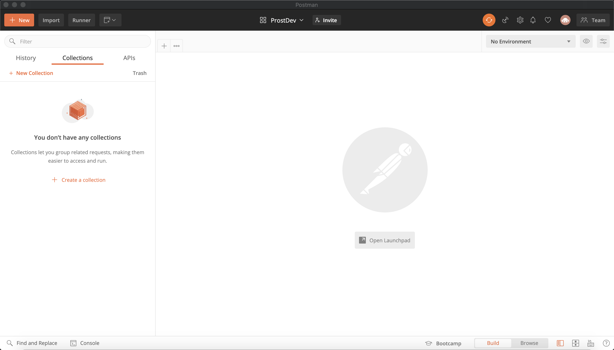
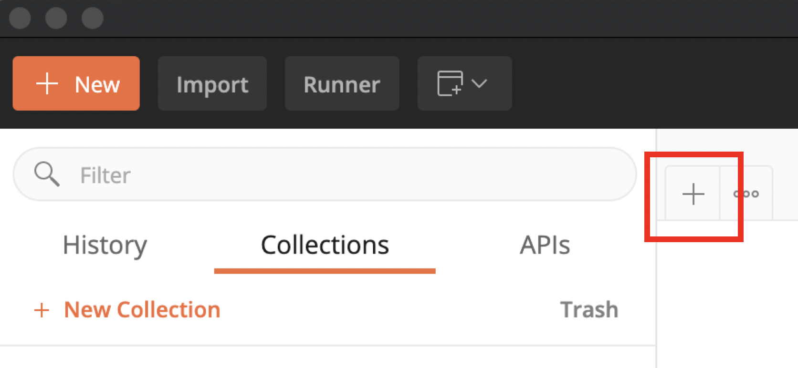
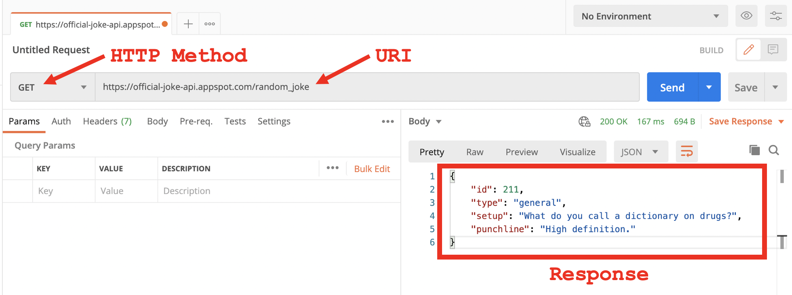
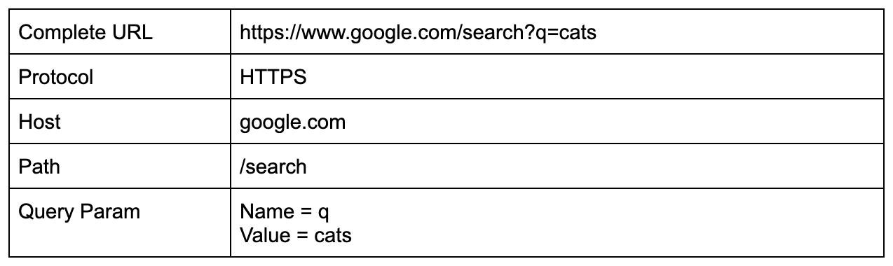
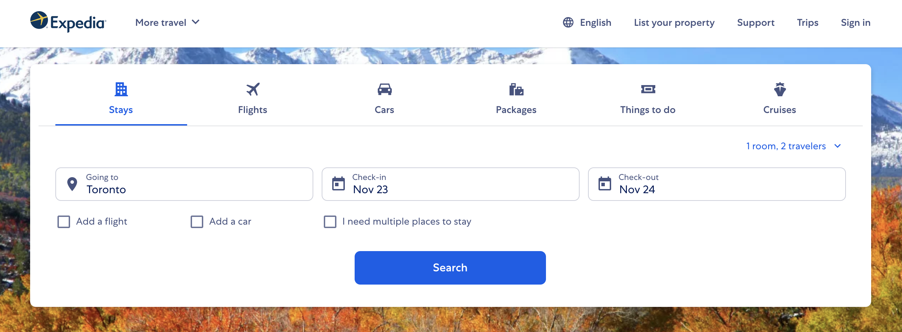
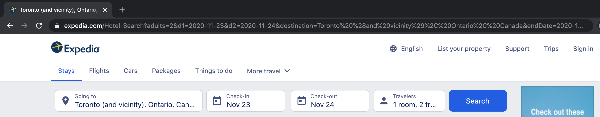
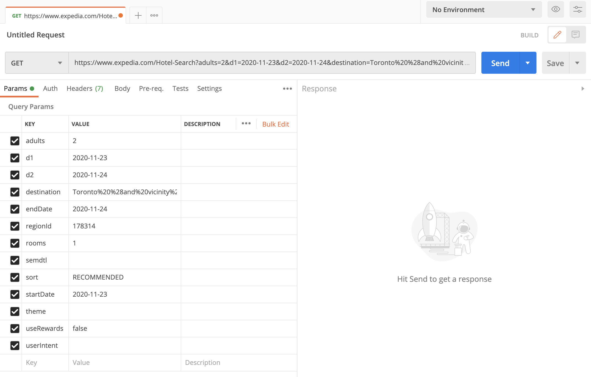
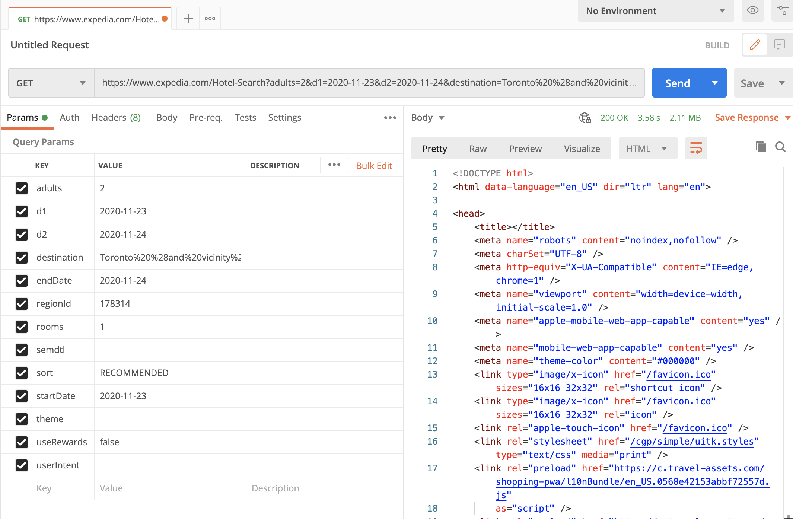
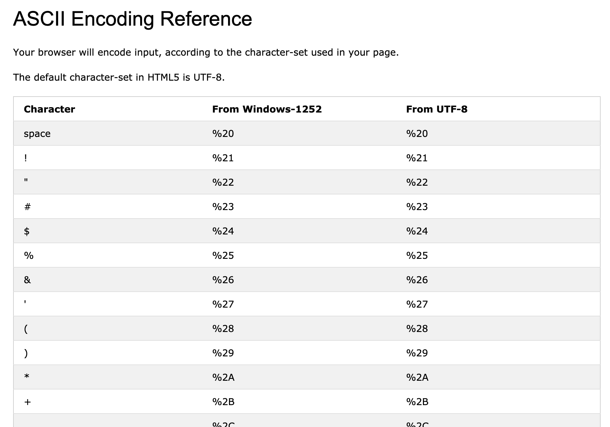
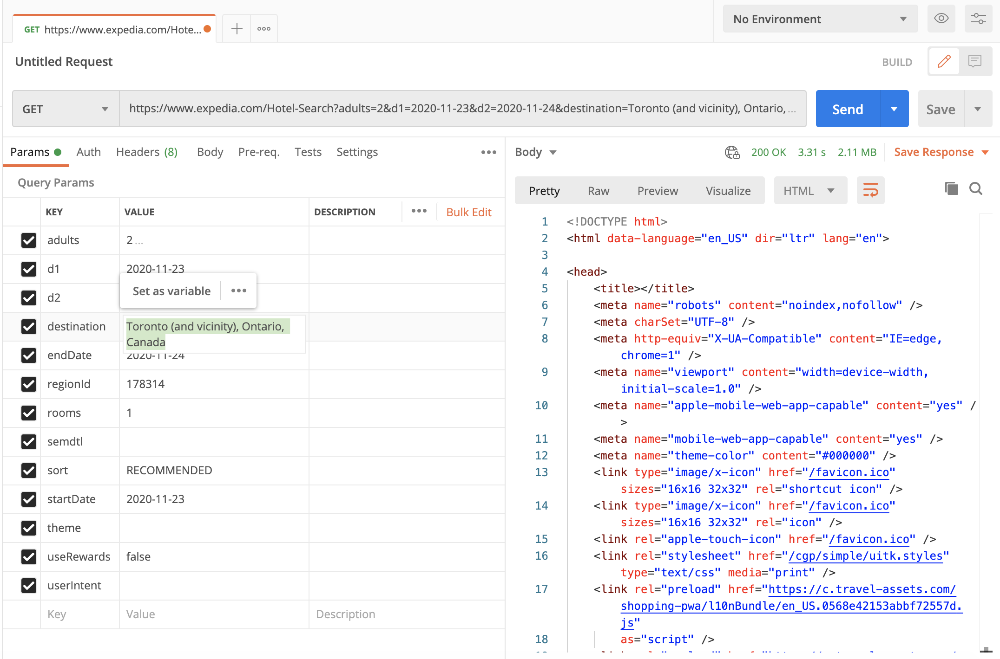

Part 5 already! What a trip it’s been. :)

Let’s recap what we have learned so far:

- [Understanding APIs (Part 1): What is an API?](https://www.prostdev.com/post/understanding-apis-part-1-what-is-an-api) - We defined the initial diagram.
- [Understanding APIs (Part 2): API Analogies and Examples](https://www.prostdev.com/post/understanding-apis-part-2-api-analogies-and-examples) - We talked about the Restaurant and Calculator analogies and looked at the Human Resources API example.
- [Understanding APIs (Part 3): What are HTTP Methods?](https://www.prostdev.com/post/understanding-apis-part-3-what-are-http-methods) - We learned the 5 most popular HTTP methods: GET, POST, PUT, PATCH, and DELETE.
- [Understanding APIs (Part 4): What is a URI?](https://www.prostdev.com/post/understanding-apis-part-4-what-is-a-uri) - We learned that a URL is just a form of URI. We broke down a URI into protocol (HTTP/HTTPS), host, and path.


Continuing with the last topic, URIs, we will now get started using Postman and learning what Query Parameters are.

## Getting started with Postman

You can download Postman for free from their [website](https://www.postman.com/downloads/). Once you have it, open it, and it will look something like this:



Now let’s click on the plus (+) button as indicated below.



This will open a new Untitled Request. Let’s paste the following URI into the text box that says “Enter request URL” -

```
https://official-joke-api.appspot.com/random_joke
```

Now click on “Send.” You should be able to see a formatted Response similar to this:



> [!NOTE]
> If the Response appears at the bottom of the screen and not on the right, you can change Postman’s layout by going to Postman preferences (or settings) > General tab > Check that the User Interface is set as Two-pane view.

Congratulations! You just made a call to the [Joke API](https://github.com/15Dkatz/official_joke_api) using Postman.

## What are Query Parameters?

Query Parameters (also known as Query Params), which are appended to the URI, are fields that are used to send additional information or data to the API. They are usually used to filter or search for data. For example, if you want to search for “cats” from Google, you can simply use this URI: [https://www.google.com/search?q=cats](https://www.google.com/search?q=cats). Let’s break down this URL like we did in the last post.



In this case, there’s only one Query Param, which is named “q,” and the value we’re sending is “cats.” For Google, when you call the path “/search” and attach the “q” Query Parameter, it knows that you want to perform a Google search with the word “cats.”

So what are the elements of a Query Param?

- **(?)** - We can identify the Query Parameters in a URI because they follow the question mark (?).
- **(=)** - The Query Param name will be located before the equal sign (=), and the value will go after it. In this case, the value “cats” is being assigned to the Query Param called “q.”
- **(&)** - If there were more Query Params in the same URI, they would be attached using the ampersand character (&).

E.g.

```
myhost.com/mypath?queryparam1=cats&queryparam2=dogs&queryparam3=squirrels
```

## Example: Expedia

Let’s now get into a more complex example. In your browser, go to [Expedia.com](https://www.expedia.com/) and search for a hotel.



After you click “Search,” take a look at the URL in your browser.



For me, it looks like this:

```
https://www.expedia.com/Hotel-Search?adults=2&d1=2020-11-23&d2=2020-11-24&destination=Toronto%20%28and%20vicinity%29%2C%20Ontario%2C%20Canada&endDate=2020-11-24&regionId=178314&rooms=1&semdtl=&sort=RECOMMENDED&startDate=2020-11-23&theme=&useRewards=false&userIntent
```

Let’s put this URI in Postman and see what happens.



A bunch of Query Params just appeared! Postman is smart enough to know that everything that comes after the question mark (?) are Query Parameters. They are shown in this neat way to read/modify/add/delete them more easily.

If you click “Send,” you will see some of the HTML code behind the Expedia website. This is the data that your browser sees and then translates into visuals for you.



Take a look at the “destination” Query Param. Its value will look something like this:

```
Toronto%20%28and%20vicinity%29%2C%20Ontario%2C%20Canada
```

Notice how there are some numbers after the percentages (%) like “%20”, “%28”, “%29”. This is because the URIs can’t contain some characters such as a space, parentheses or commas. So such characters are translated into these “%20” encodings. Here are some examples:



So, if we translate “Toronto%20%28and%20vicinity%29%2C%20Ontario%2C%20Canada” back into the original string, this is what it says: “Toronto (and vicinity), Ontario, Canada”.

What would happen if we paste the original string directly into the “destination” Query Param in Postman? Let’s do it and resend the Request to see if it works.



It worked! Postman is smart enough to know that these characters will need to be translated into the ASCII Encoding and does it in the background without us noticing. If you try to call this URL from your browser, it will also work, but your browser will show you the translated URL just as before.

Notice how all these Query Params are information that the backend will use to filter the results that it will show you. For example, adults=2, rooms=1, endDate=2020-11-24, startDate=2020-11-23. With these Params, the server knows not to show you hotels that won’t be available for two adults or that won’t be available from November 23 to November 24.

## Recap

- Postman is a tool that can help us call our APIs with a user-friendly interface. You can download the application from their website.
- Postman can automatically format the JSON Responses you get from an API, so it’s more human-readable.
- Postman shows your Query Params so you can conveniently add/read/modify/delete them as you wish.
- Query Parameters (also known as Query Params), which are appended to the URI, are fields that are used to send additional information or data to the API.
- There is a special HTML URL Encoding that needs to be used to read special characters like spaces, commas, or parentheses. Postman translates this automatically for you.

Even though we didn’t use the Expedia API, we were able to call the Expedia website. We learned how the Query Parameters work in a real-life example and how to identify them in a URI.

In the next post, we will be learning about a component that is found in the Response of our APIs: the HTTP Status Codes.

Subscribe now to receive a notification as soon as this post is published!

*Prost!*

-Alex
