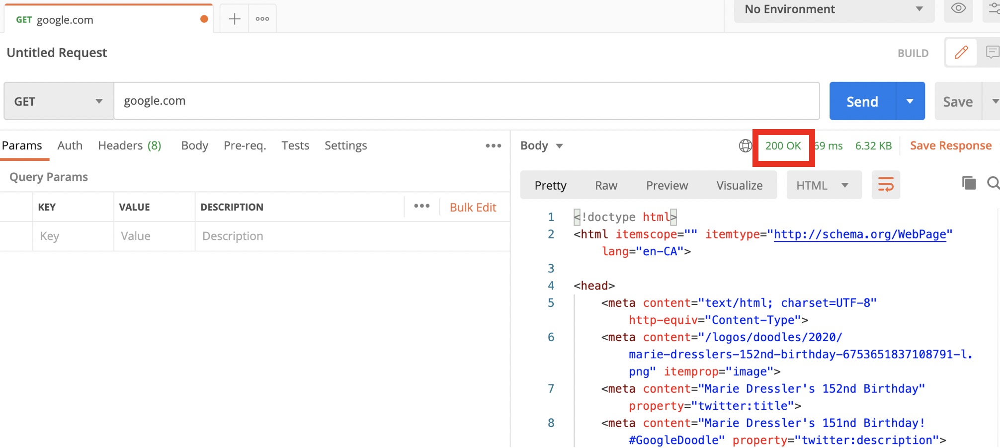

We’re almost done learning the basic concepts we need to understand APIs better.

Let’s recap what we have learned so far:

- [Understanding APIs (Part 1): What is an API?](https://www.prostdev.com/post/understanding-apis-part-1-what-is-an-api) - We defined the initial diagram.
- [Understanding APIs (Part 2): API Analogies and Examples](https://www.prostdev.com/post/understanding-apis-part-2-api-analogies-and-examples) - We talked about the Restaurant and Calculator analogies and defined the Human Resources API example.
- [Understanding APIs (Part 3): What are HTTP Methods?](https://www.prostdev.com/post/understanding-apis-part-3-what-are-http-methods) - We learned the 5 most popular HTTP methods: GET, POST, PUT, PATCH, and DELETE.
- [Understanding APIs (Part 4): What is a URI?](https://www.prostdev.com/post/understanding-apis-part-4-what-is-a-uri) - We learned that a URL is just a form of URI. We broke down a URI into protocol, host, and path.
- [Understanding APIs (Part 5): Intro to Postman and Query Parameters](https://www.prostdev.com/post/understanding-apis-part-5-intro-to-postman-and-query-parameters) - We learned how to use Postman and what Query Parameters are.

The last 3 posts mentioned components sent in the Request that tell the API what data we want to receive. This time, we’ll be talking about a part of the Response: the HTTP Status Codes.

## What are HTTP Status Codes?

HTTP Status Codes are numbers returned by the API which are included in the Response. They indicate if the operation you wanted to perform was a success or not, and they describe the kind of success/failure that happened. It’s basically a conversation with the server where it tells you, “here is the data you requested,” “your Request is not correct; please take a look,” “I’m having internet issues; please try again later.”

There are a lot of Status Codes reserved for certain API Responses, but we will be looking at the most popular ones: 200, 201, 202, 204, 400, 401, 403, 404, and 500. You can find a complete list [here](https://www.restapitutorial.com/httpstatuscodes.html) with their definitions.

> [!NOTE]
> Any developer, API designer, or architect can choose the status codes they want the API to return. Some APIs only return 200, while others only return 200, 400, and 500. However, I will follow the best practices shown by [REST API Tutorial](https://www.restapitutorial.com/httpstatuscodes.html).

**200 OK**

This code is returned when the Request is a success, and there are no errors whatsoever. It’s mainly returned when using a GET or a POST. The Response will contain the data requested by the GET or the data created/updated by the POST.

**201 Created**

This code means that the Request is a success and that a new resource was created. For example, a new employee was added to the company list successfully. The Response usually contains the data that was just created. It’s mainly returned when using a POST or a PUT.

**202 Accepted**

This code is returned when some processing is still pending, but it hasn’t been completed yet. This code is especially useful when the back-end processing of the information will take too long to complete, so the user receives a confirmation of the Request along with a pointer to monitor the processing status. Note that this doesn’t mean that the Request was a success. It just means that the server received it, but it can still fail its processing.

**204 No Content**

This code means that the Request is a success, but there is no data to be returned. For example, when deleting a resource, nothing is returned because it no longer exists. It’s mainly returned when using DELETE.

**400 Bad Request**

The Request contains a syntax error that could not be understood by the server. For example, if your Request needs to have a field called “FullName” and you don’t send it to the API, it will return this error.

**401 Unauthorized**

This code is returned when the Request must contain some authorization information to use the API, like a username and a password. However, this data was not included or was wrong.

**403 Forbidden**

This code is returned when the API refuses to return some information. The Request and the authorization are ok, but for some other reason the data can’t be returned. For example, when you have a session opened for too long, it expires, and when you click a button or request additional info, you can’t anymore.

**404 Not Found**

This code is one of the most commonly seen from a web browser. It means the server didn’t find what you were looking for, mostly because it doesn’t exist. For example, if you try to access [http://google.com/test](http://google.com/test), you will get this error because the “test” path doesn’t exist.

**500 Internal Server Error**

This code is returned when there is an error inside the API. The Request was perfectly fine, and there were no errors when calling the server, but then something failed inside the Implementation. This is the most generic error that can be used when the server fails.

## HTTP Status Codes in Postman

Go to Postman and send a new GET Request to “google.com”. You will receive an HTML response, and you will be able to see the HTTP Status Code right over the Response.

> [!NOTE]
> If you’re new to Postman, you should check out the previous post of this series: "[Understanding APIs (Part 5): Intro to Postman and Query Parameters](https://www.prostdev.com/post/understanding-apis-part-5-intro-to-postman-and-query-parameters)."

**Quiz**: What HTTP Status Code do you receive when sending a GET Request to “https://api.twitter.com/2/tweets/1234” from Postman?

*The answer will be revealed in the next post.*

## Recap

- **HTTP Status Codes** are numbers returned in the API’s Response to indicate if the Request was successfully processed or if there was an error.
- **200 OK** means the Request is a success and returns the requested information.
- **201 Created** means there is a new resource added, and the Response contains this new information.
- **202 Accepted** means the Request is accepted but is still processing.
- **204 No Content** means the Request is successful, but no data can be returned.
- **400 Bad Request** means there is something wrong with your Request.
- **401 Unauthorized** means you didn’t send the proper credentials to access the URI or perform the Operation.
- **403 Forbidden** means the information can’t be returned for some reason, like a time limit.
- **404 Not Found** means the resource/URI you are trying to access does not exist.
- **500 Internal Server Error** means something went wrong inside the Implementation or within the server.

I need to tell you this joke because it’s too good to miss. A parent tells the teenager to clean their room. The teenager responds, “202,” and the parent goes away. Some hours later, the parent comes back to see that the room is still dirty and asks why it isn’t clean yet. The teenager answers, “I said 202, not 200.”

Sorry. [#GeekyHumor](https://www.prostdev.com/blog/hashtags/GeekyHumor)

*Prost!*

-Alex
