Are you familiar with the fromBase64 or the toBase64 functions from DataWeave 2.0? What about the getUrlEncoder or the getEncoder functions from Java? Do you know the differences between the “basic” Base 64 encoding and the “URL and Filename safe” Base 64 encoding? Well, you may have guessed it by now, but you’re about to find out the answers to these questions!

Or maybe you’re here because you keep getting the “Illegal base64 character” error in DataWeave. Even if you get this error using any other programming language, this post can help you understand why it is happening.

## The Problem

I was recently presented with this problem when Maria Isabel Vargas asked a question about base64 decoding in a Slack channel. She was using the [fromBase64](https://docs.mulesoft.com/mule-runtime/4.3/dw-binaries-functions-frombase64) function that’s available in Mule 4 - DataWeave 2.0 inside the [dw::core::Binaries](https://docs.mulesoft.com/mule-runtime/4.3/dw-binaries) module to transform a basic Base 64 string into a binary value.

The problem was that the server was returning a Base 64 **URL** Encoded String (e.g. “cHJvc3RkZXY**_**YmxvZw==”) opposed to the **basic** Base 64 string from which the fromBase64 function attempts to transform. As a result, the Transform Message component was returning this error: “Illegal base64 character 5f". This error happens when the string that you are trying to transform contains a character not recognized by the **basic** Base 64 Alphabet (in this case it was an underscore character). Below you can see which characters are accepted.

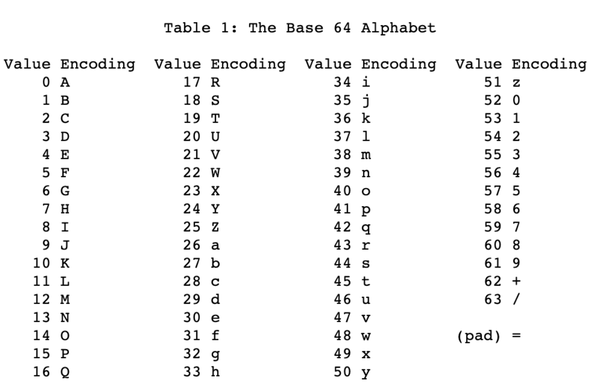

Since the server was using the Base 64 **URL** encoding, the string that we were trying to decode in DataWeave contained different characters from the ones above because the Base 64 URL has a different alphabet. You can see this alphabet below.

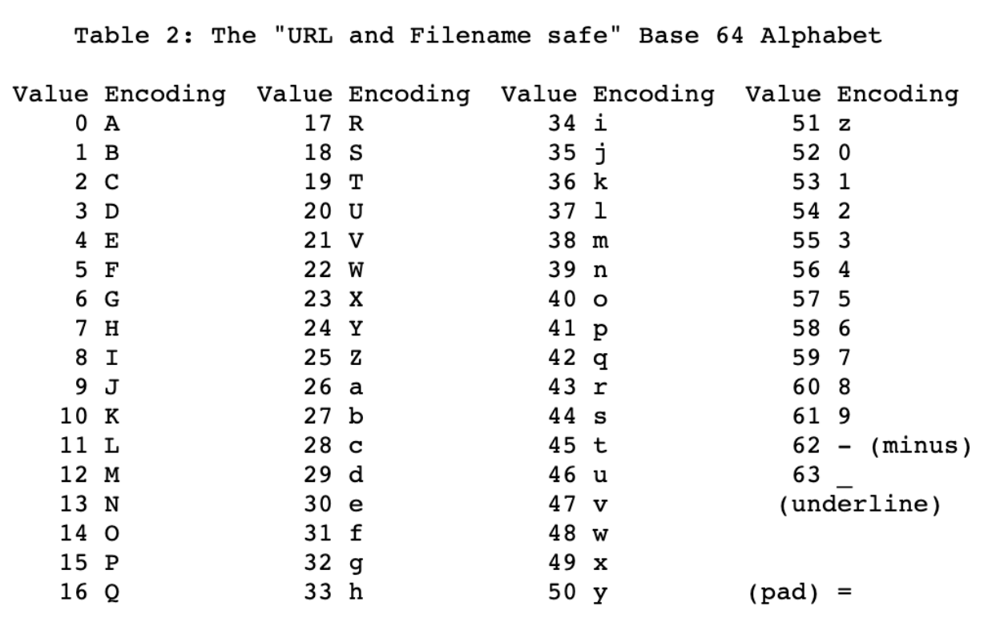

Notice that the characters 62 and 63 differ from the **basic** Base 64 Alphabet and the Base 64 **URL** Alphabet. The first one contains the characters plus (+) and slash (/), while the second one uses the characters minus (-) and underline (_).

In other words, if you have an encoded string like "cHJvc3RkZXY_YmxvZw==", you wouldn’t be able to transform it using a **basic** Base64 decoder because it contains characters that are not recognized by its alphabet (the underline character).

You can get these two errors when you try to transform a Base 64 **URL** string using the fromBase64 DW function (at least when this post was created):

- java.lang.IllegalArgumentException: Illegal base64 character 5f (when containing an underscore)
- java.lang.IllegalArgumentException: Illegal base64 character 2d (when containing a minus)

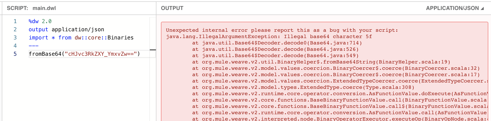

## The Solution

Java contains a function called [getUrlDecoder](https://docs.oracle.com/javase/8/docs/api/java/util/Base64.html#getUrlEncoder--), which is used to decode a string that was encoded using the Base 64 **URL** alphabet. This is exactly the problem that we were trying to solve. But before you start panicking and coding your solution using Java and creating a whole Java class, it's way easier to just use the [Mule 4 Scripting Module](https://docs.mulesoft.com/scripting-module/1.1/). I’ll show you how.

This module should already be installed in your Studio. However, if you can’t see it, you can download it from Exchange. Alternatively, you can use the “Add Modules” button from Anypoint Studio, which is located on your Mule Palette.

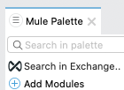

After that, you can simply take the Execute component and drag-and-drop it into your flow. For this demonstration, I will be using an HTTP Listener as a trigger, and I will send the encoded string in the body of the request from Postman.

Once you have the Execute component, you can select “Groovy” as your Engine and paste the following line of code into your script:

```groovy
Base64.getUrlDecoder().decode(payload)
```

You should end up with this:

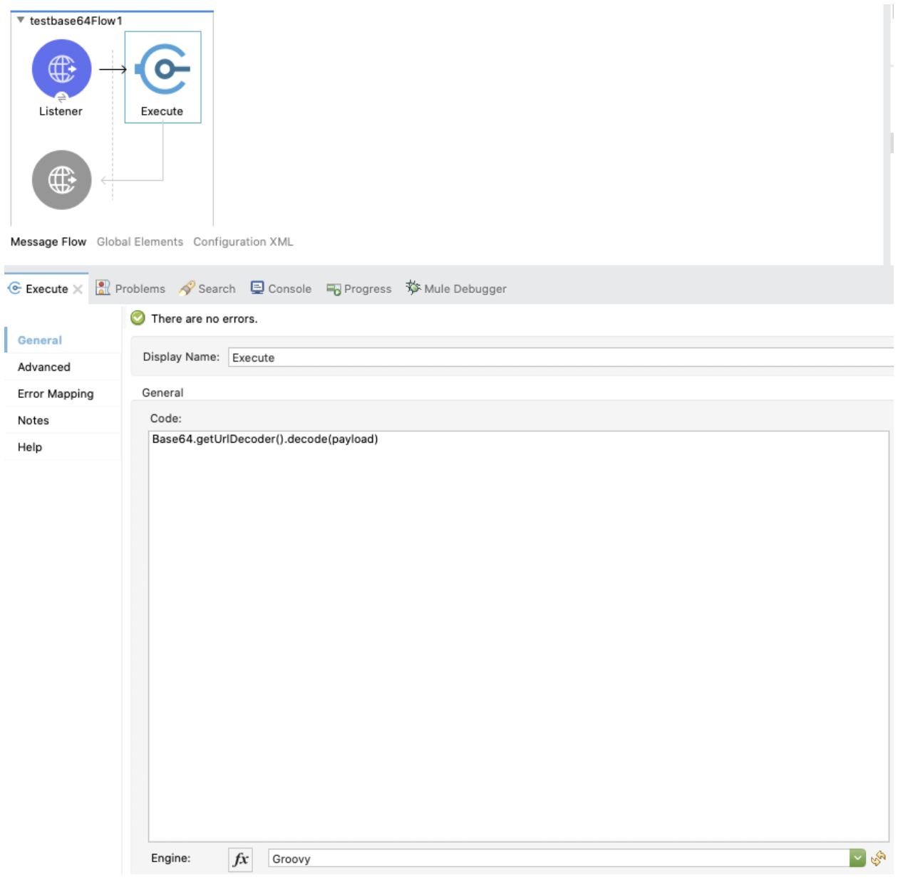

As you can see in this Groovy script, we are using the getUrlDecoder function to decode whatever is in our payload. The result will be returned to our Postman application in the body of the response.

You need to make sure that the payload that is sent to the Groovy script is a Java String. So, let’s add a Transform Message right after the HTTP Listener and transform the payload into a Java string. Like this:

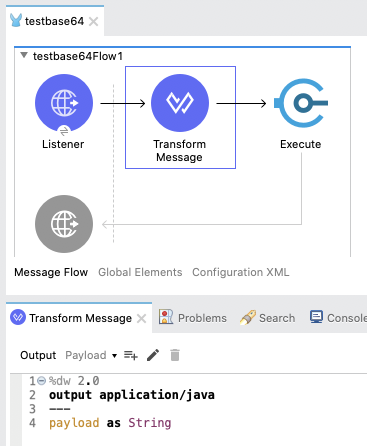

Let’s start this Mule app and test!

We send the same string as before (cHJvc3RkZXY_YmxvZw==) from Postman, and we expect to get the decoded message as a response.

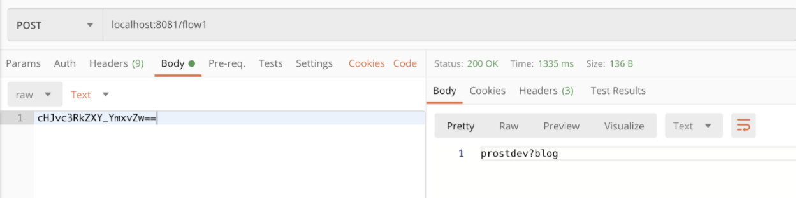

And… it worked!

## Try it yourself

Do you want to experiment a bit more with all of this? For sure! Let me give you a quick guide on how to do this.

### 1. Encode the bytes/string into a Basic 64 URL encoded string

You will need Java (or you can also do it in Mule 4 using a Groovy script) to get the encoded string first. You don’t need to download and install Java onto your computer to do this; you can search for a free online Java compiler like this one: [TutorialsPoint Java Compiler](https://www.tutorialspoint.com/compile_java_online.php)

There, just copy and paste this Java code:

```java
import java.util.Base64;
public class Base64UrlEncoding {
    public static void main(String []args) {
        byte[] bytes = "prostdev?blog".getBytes();
        String encodedString = new String(Base64.getUrlEncoder().encode(bytes));
        
        System.out.println(encodedString); 
    }
}
```

Next, click on “Execute” in the top left corner. You will see the encoded string on the right side of the website (the last line in the white background). Copy this string and save it somewhere so that you can use it in the next steps.

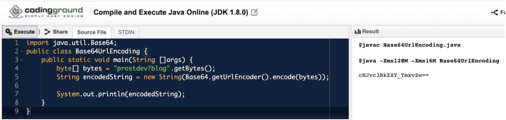

### 2. Create your Mule App in Anypoint Studio

Follow the steps explained previously in “The Solution”, or paste this code into the XML configuration of your file:

```xml
<?xml version="1.0" encoding="UTF-8"?>

<mule xmlns:http="http://www.mulesoft.org/schema/mule/http" xmlns:scripting="http://www.mulesoft.org/schema/mule/scripting"
	xmlns:ee="http://www.mulesoft.org/schema/mule/ee/core"
	xmlns="http://www.mulesoft.org/schema/mule/core" xmlns:doc="http://www.mulesoft.org/schema/mule/documentation" xmlns:xsi="http://www.w3.org/2001/XMLSchema-instance" xsi:schemaLocation="http://www.mulesoft.org/schema/mule/core http://www.mulesoft.org/schema/mule/core/current/mule.xsd
http://www.mulesoft.org/schema/mule/ee/core http://www.mulesoft.org/schema/mule/ee/core/current/mule-ee.xsd
http://www.mulesoft.org/schema/mule/scripting http://www.mulesoft.org/schema/mule/scripting/current/mule-scripting.xsd
http://www.mulesoft.org/schema/mule/http http://www.mulesoft.org/schema/mule/http/current/mule-http.xsd">
	<http:listener-config name="HTTP_Listener_config" doc:name="HTTP Listener config" doc:id="14ccf972-4bba-4789-b1f2-0ce9b8dde24f" >
		<http:listener-connection host="0.0.0.0" port="8081" />
	</http:listener-config>
	<flow name="testbase64Flow1" doc:id="ea17a087-9c19-4c9d-8379-23a7ffed04f2" >
		<http:listener doc:name="Listener" doc:id="87b87abf-95c5-4734-873d-c731ade282f4" config-ref="HTTP_Listener_config" path="/flow1"/>
		<ee:transform doc:name="Transform Message" doc:id="9bc88283-7ee0-4c5a-a466-a5cfc8fface5" >
			<ee:message >
				<ee:set-payload ><![CDATA[%dw 2.0
output application/java
---
payload as String]]></ee:set-payload>
			</ee:message>
		</ee:transform>
		<scripting:execute engine="groovy" doc:name="Execute" doc:id="7abfd446-8474-4512-a709-63c89bcd5cef" >
			<scripting:code ><![CDATA[Base64.getUrlDecoder().decode(payload)]]></scripting:code>
		</scripting:execute>
	</flow>
</mule>
```

### 3. Create a Postman request

If you don’t have Postman, you can download it for free from here: [Postman Download](https://www.postman.com/downloads/). When you open it, you just have to click on the plus (+) button as you can see here:

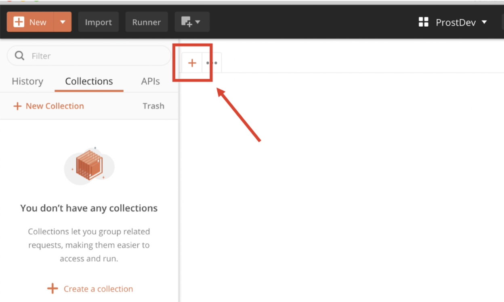

Then, add this in the Request URL section:

```
localhost:8081/flow1
```

And add the previously copied string inside the Request Body. Don’t forget to select “Raw” and “Text” from the two dropdowns that are over the request body text area.

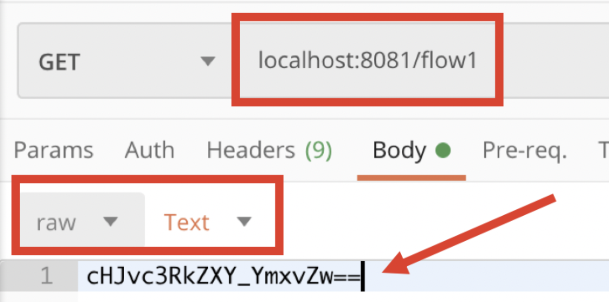

### 4. Run your Mule App

Once it is deployed successfully, you can click on the big blue “Send” button from Postman and see the results which should match the string you encoded in Step 1 (using Java).

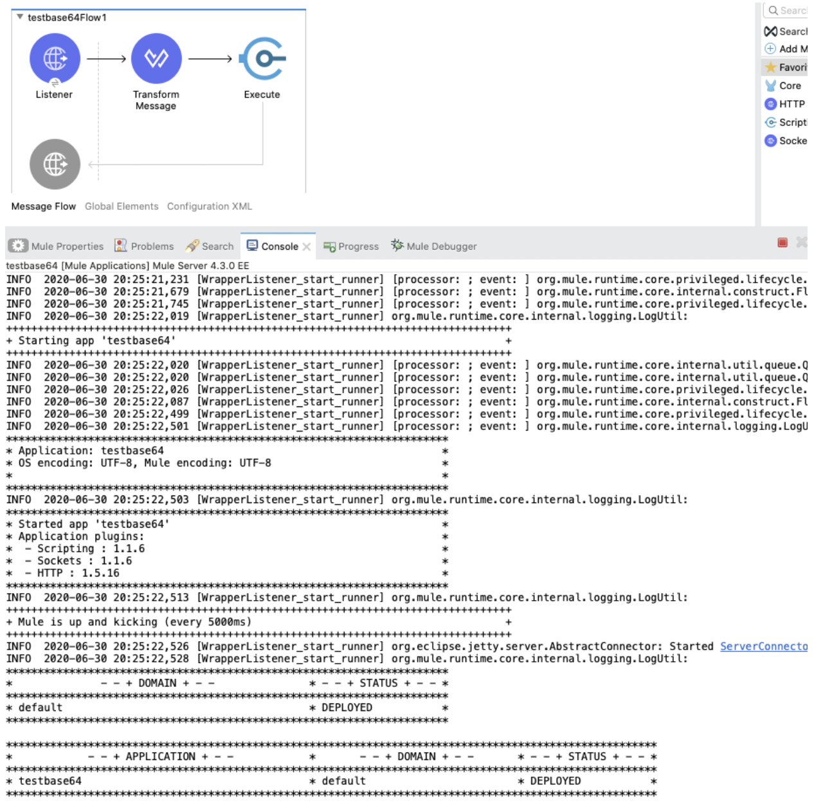


## Recap

Let’s do a quick recap on what we just learned from this post:

- The **basic** Base 64 alphabet can recognize the characters plus (+) and slash (/).
- The Base 64 **URL** alphabet can recognize the characters minus (-) and underline (_).
- Depending on how a string was encoded (using basic Base 64 or Base 64 URL encoding), it can include any of the characters from the chosen alphabet.
- An encoded string with one alphabet may not be decoded using the other alphabet’s decoding system. If the decoder attempts to read an unrecognized character, it’ll send an Illegal base64 character error message.
- You **can’t** decode a Base 64 **URL** string with the fromBase64 DataWeave 2.0 function.
- You **can** decode a Base 64 **URL** string by using an Execute component along with a Groovy engine and the getUrlDecoder Java function.

Had you seen this error before? How did you solve it?

*Prost!*

-Alex

## References

- [Mule docs - fromBase64 function](https://docs.mulesoft.com/mule-runtime/4.3/dw-binaries-functions-frombase64)
- [Mule docs - dw::core::Binaries](https://docs.mulesoft.com/mule-runtime/4.3/dw-binaries)
- [Mule docs - Scripting Module](https://docs.mulesoft.com/scripting-module/1.1/)
- [IETF - RFC4648](https://www.ietf.org/rfc/rfc4648.txt)
- [Oracle docs - getUrlEncoder](https://docs.oracle.com/javase/8/docs/api/java/util/Base64.html#getUrlEncoder--)
- [TutorialsPoint - Online Java compiler](https://www.tutorialspoint.com/compile_java_online.php)
- [Download Postman](https://www.postman.com/downloads/)

### GitHub repository

[ProstDev GitHub - testbase64](https://github.com/ProstDev/testbase64)
