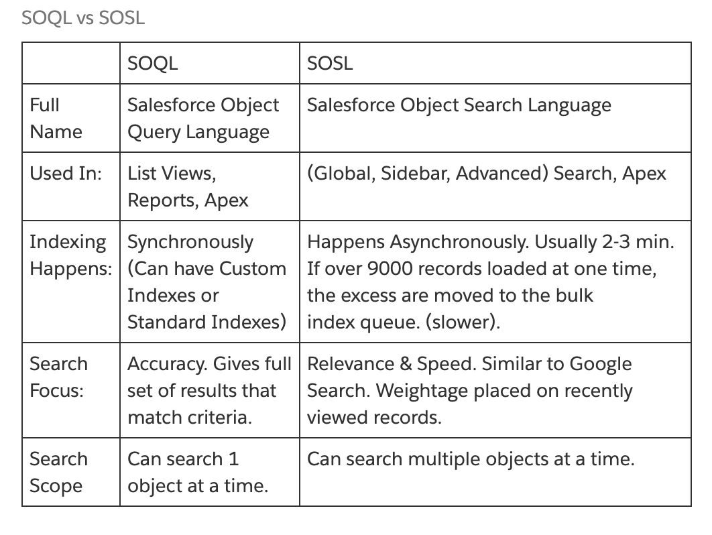
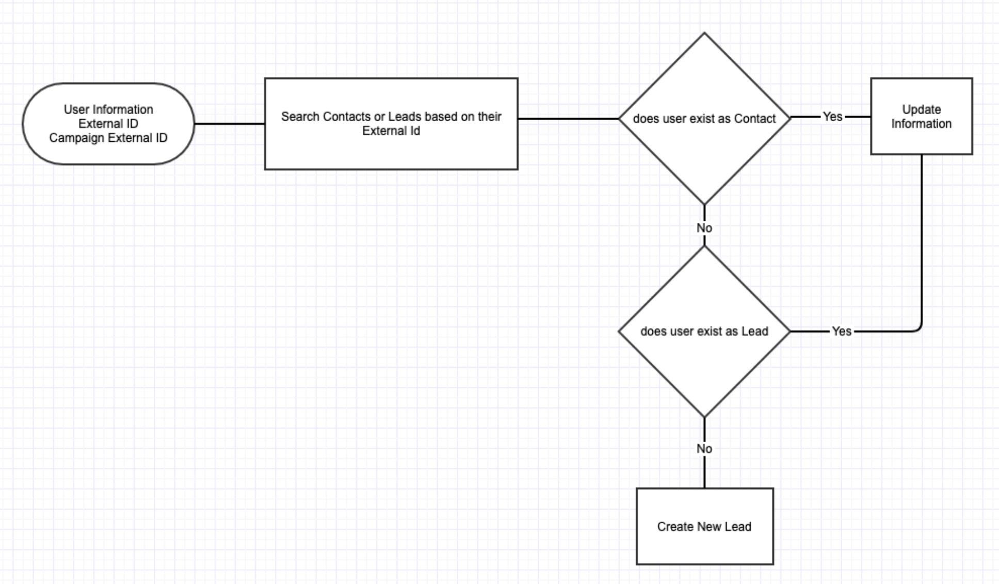
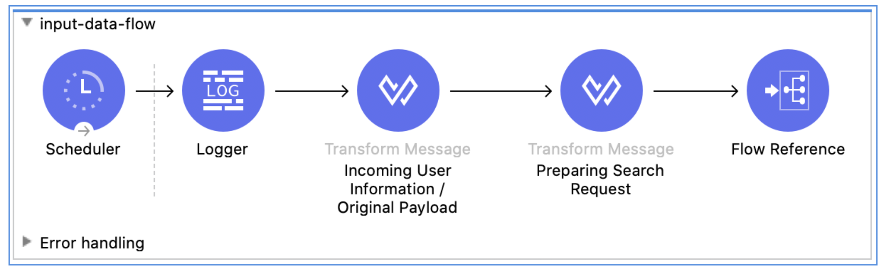
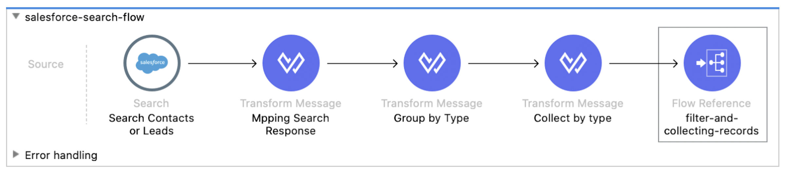
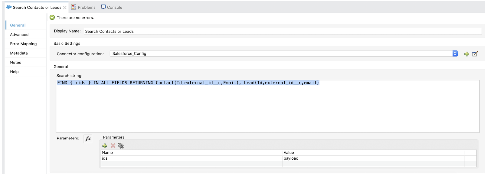
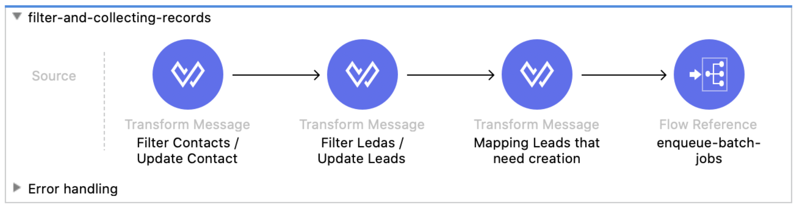
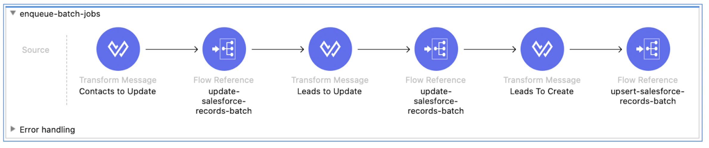
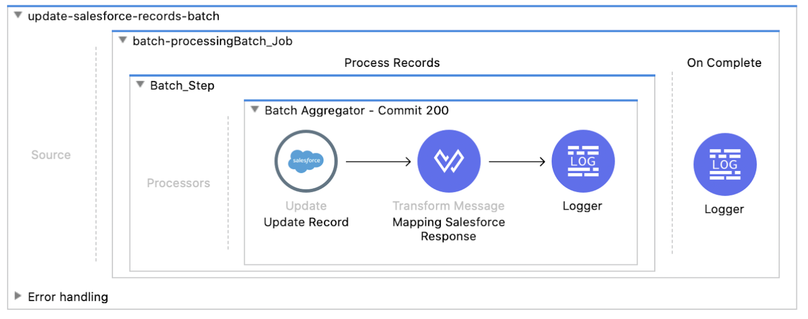
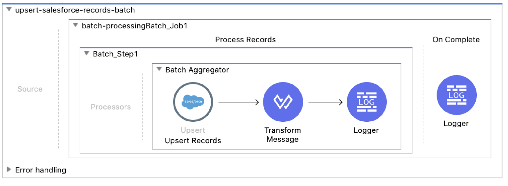

*GitHub repository with the Mule project can be found at the end of the post.*

One of the most used actions when we work with Salesforce integrations is the use of query. It allows us to pull information from any table, do some subqueries, and pull relationship data. But there’s one action we, as developers, don’t use very often (sometimes we don’t even know this operation is available for us) and it is the Salesforce Object Search Language (**SOSL**).

## SOSL and SOQL

Based on the [Force.com Developer documentation](https://developer.salesforce.com/docs/atlas.en-us.soql_sosl.meta/soql_sosl/sforce_api_calls_soql_sosl_intro.htm):

A SOQL query is the equivalent of a SELECT SQL statement and searches the org database. SOSL is a programmatic way of performing a text-based search against the search index.

Whether you use SOQL or SOSL depends on whether you know which objects or fields you want to search, plus other considerations.

Use SOQL when you know which objects the data resides in, and you want to:

- Retrieve data from a single object or from multiple objects that are related to one another.
- Count the number of records that meet specified criteria.
- Sort results as part of the query.
- Retrieve data from number, date, or checkbox fields.

Use SOSL when you don’t know which object or field the data resides in, and you want to:

- Retrieve data for a specific term that you know exists within a field. Because SOSL can tokenize multiple terms within a field and build a search index from this, SOSL searches are faster and can return more relevant results.
- Retrieve multiple objects and fields efficiently where the objects might or might not be related to one another.
- Retrieve data for a particular division in an organization using the divisions feature.
- Retrieve data that’s in Chinese, Japanese, Korean, or Thai. Morphological tokenization for CJKT terms helps ensure accurate results.

Here are some differences between SOSL and SOQL.



You might be asking yourself how this is helpful and how you can use it. Well, let’s think of a scenario.

## Scenario

The general idea is to be able to process **User** information coming from any source and use the information to be able to validate if a **Contact** or **Lead** already exists in the platform using a specific external Id field. Based on the result we should be able to update a Contact / Lead or create a brand new Lead record.



## Implementation

I will create a pretty simple application to demonstrate how we can accomplish this. The Mule application would be created in Mule 4 and I will set a few records in a DataWeave component to simulate the input payload.

## input-data-flow



This flow contains a scheduler to manually trigger the integration for demonstration purposes. Then we set the incoming payload in a DataWeave component just like this:

There’s a variable called “**originalPayload**”, which will be used to filter the information out once we get Salesforce information.

In the next DW component (Preparing Search Request) we just convert all the external Id values from the original response to a plain string value concatenated by **OR**, making this an understandable payload value for the Salesforce search. The code looks like this:

```dataweave
%dw 2.0
output application/java
---
(payload map {
  ids: "\"" ++ ($.id) ++ "\"" 
}.ids) joinBy " OR "
```

## salesforce-search-flow



This flow will be in charge of making the search call into Salesforce, grouping the response and creating the variables we need to filter the originalPayload with the existing records.

In the Salesforce search, I will pass the next expression:

```
FIND { :ids } IN ALL FIELDS RETURNING Contact(Id,external_id__c,Email), Lead(Id,external_id__c,email)
```

Where the :ids parameter is the previous string we created separating the Ids by OR. In this search we are asking Salesforce to retrieve the records from Contacts and Leads searching in all the fields. After the information is returned, we can tell which fields we need from each object.



"Mapping Search Response" component just creates a map of the Salesforce results (payload.searchRecords). After this, we will group the information by type. We will use this script:

```dataweave
%dw 2.0
output application/java
---
(payload groupBy ((value, index) -> value."type"))
```

In the same component, I’m creating a variable called **salesforceResponseMap** which contains a key-value map we can access using a value to get the full record.

```dataweave
%dw 2.0
output application/java
---
{
  (payload map {
    (($.external_id__c):$) if $.Id != null 
  })
}
```

“Collect by type” is a different variable that allows us to separate the records from the Contacts and Leads we found and set the Id as the main key in order to be able to filter the data in the next components. At this point we already know which Contacts and Leads have been found.

```dataweave
%dw 2.0
output application/java
---
{
  fromContacts: payload.Contact map (salesforceContact, IndexOfContact)->{
    (id: salesforceContact.external_id__c) if (salesforceContact.external_id__c != null),
  },
  fromLeads: payload.Lead map (salesforceLead, indexOfLeads)->{
    (id: salesforceLead.external_id__c) if (salesforceLead.external_id__c != null),
  }
}
```

## filter-and-collecting-records



This flow will filter the data from the original payload by removing existing contacts from Salesforce and leaving the records that need to be created as Leads.

“Filter Contacts / Update Contact” will take any existing records from the groupedObjects.fromContacts variable based on the Id using this script:

```dataweave
%dw 2.0
output application/java
---
vars.originalPayload filter (not (vars.groupedObjects.fromContacts.id contains ($.id)))
```

We are basically removing the records to an array from another one.

In the same component we are doing basically the same but without the not operator so it means we are collecting the information that needs to be updated as Contact and we are able to map the fields we need to update.

```dataweave
%dw 2.0
output application/java
---
(vars.originalPayload filter ((vars.groupedObjects.fromContacts.id contains ($.id))) map (contact, indexOfContact) -> {
  Id: vars.salesforceResponseMap[contact.id].Id,
  FirstName: contact."First Name"
})
```

“Filter Leads / Update Leads” is basically the same but using the Leads group.

Finally the remaining component collects the remaining information of records that need to be created as Leads in Salesforce and we can map the information.

## enqueue-batch-jobs

The meaning of this job is just to set the payloads for update and create records, the only additional thing on this component is that we are specifying the **sObject** and externald **variables**, so, instead of adding a batch component for each type, dynamically we are dynamically passing the sObject for updates and sObject and externalId for upsert calls. This means we can reuse our batch processes.



Finally we can see the **batch processing flow**. One batch will focus in updating the objects and just control the response from Salesforce with a DW component like this:

```dataweave
%dw 2.0
output application/json
---
payload.items map {
  id: $.id,
  success: $.successful,
  (field: $.errors[0].fields[0]) if $.successful == false,  
  (message: $.errors[0].message) if $.successful == false,
  (statusCode: $.errors[0].statusCode) if $.successful == false
}
```

Basically, we can collect the responses and use them.





There are some things to consider when using SOSL over SOQL: One of the advantages of this is that we are able to retrieve multiple objects in a call and we are saving a couple of API calls - This can be used on processes that need just a few records. Massive amounts of data might include some complexity on how we create the SOSL expression, but in the end we can just adjust the limits ([https://developer.salesforce.com/docs/atlas.en-us.soql_sosl.meta/soql_sosl/sforce_api_calls_sosl_limits.htm](https://developer.salesforce.com/docs/atlas.en-us.soql_sosl.meta/soql_sosl/sforce_api_calls_sosl_limits.htm)) in case we need to.

Let me know if you think this is helpful and I will be happy to enhance this process as well.

## GitHub repository

You can pull the code from this [repository](https://github.com/emoran/yucelmoran-salesforce-search) if you want to see the whole process working.
