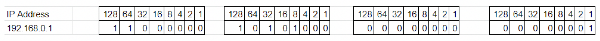
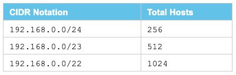
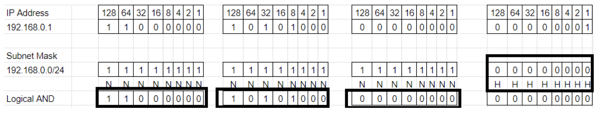
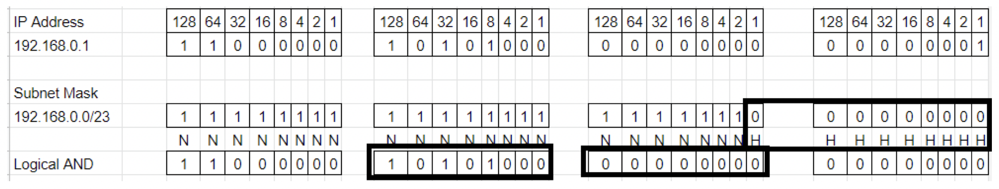
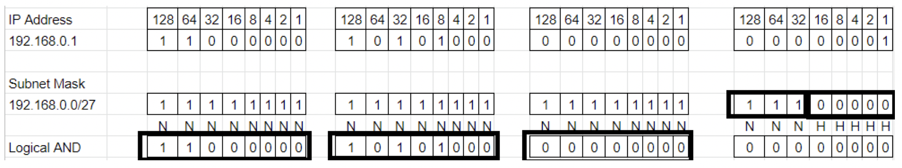
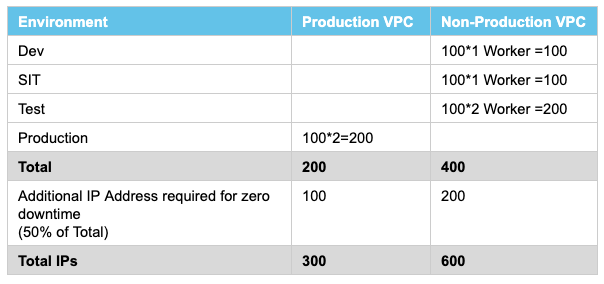

## Introduction

CIDR stands for Classless Inter-Domain Routing and it’s a way of allocating IP addresses or hosts in a more efficient manner. It replaces the old way of allocating IP addresses based on the class system. This method allocates the IP Addresses or hosts in a more efficient way and avoids the waste of IP Addresses.

- Class A: 16 million host identifiers or IP Addresses.
- Class B: 65,535 host identifiers or IP Addresses.
- Class C: 254 host identifiers or IP Addresses.

Let's consider the Organization requires around 500 IP Addresses or Hosts. In such cases, organizations have to go with a Class B IP distribution system where almost more than 60,000 IP addresses are wasted.

## What is an IP Address?

IP Addresses consist of two groups of bits in the address, the most significant bits are network the prefix, which identifies the network or subnet; and the least significant bits are the host identifier, which specifies a particular interface of the host on that network.

IP Addresses have 2 components:

- Network Address
- Host Address

Each IP Address (IPv4) is 32 bit or 4 Octet. Below is the representation of an IP Address in Binary:



CIDR Block Notation:

```
xxx.xxx.xxx.xxx/n
```

where n is the number of bits used for the subnet mask.

The subnet mask is made up of setting up all network bits to all ones and host bits to all zeros.

Let's consider this scenario: if you provide this CIDR Block 192.168.0.0/24, it will give 255 hosts or IP addresses.



## What is a Subnet?

A subnetwork or subnet is a logical subdivision of an IP network. The practice of dividing a network into two or more networks is called subnetting. Computers that belong to a subnet are addressed with an identical most-significant bit-group in their IP addresses.

Now, we will see how to Calculate the total number of hosts using Subnet Mask.

## Use Case 1

Subnet Mask 192.168.0.0/24 will equate to IP Range 192.168.0.0 — 192.168.0.255.



N represents Network and H represents Host. In the above example, we made 24 bits to ones and the remaining 8 bits to zeros because the Subnet Mask end range is 24. Total zeros are 8 for Host (2*2*2*2*2*2*2*2=256).

This will give an IP range of 192.168.0.0 — 192.168.0.255 (256 Hosts in total).

## Use Case 2

Subnet Mask 192.168.0.0/23 will equate to IP Range 192.168.0.0 — 192.168.0.511.



N represents Network and H represents Host. In the above example, we made 23 bits to ones and the remaining 9 bits to zeros because the Subnet Mask end range is 23. Total zeros are 9 for Host (2*2*2*2*2*2*2*2*2=512).

This will give an IP range of 192.168.0.0 — 192.168.0.511 (512 Hosts in total).

## Use Case 3

Subnet Mask 192.168.0.0/27 will equate to IP Range 192.168.0.0 — 192.168.0.31.



N represents Network and H represents Host. In the above example, we made 27 bits to ones and the remaining 5 bits to zeros because the Subnet Mask end range is 27. Total zeros are 5 for Host (2*2*2*2*2=32).

We have borrowed 3 bits from the host to make a total of 27 bits. Subnet will be (2*2*2=8) and the Host will be 32. So we can get a total of 8 subnets.

Subnetworks will be 192.168.0.0/27, 192.168.0.31/27, 192.168.0.63/27, 192.168.0.95/27, 192.168.0.127/27, 192.168.0.159/27, 192.168.0.191/27, 192.168.0.223/27

Here we are dividing the subnet mask into smaller subnetworks.

Whenever you are creating MuleSoft VPC, you need to make sure whatever CIDR Mask you are providing doesn't conflict with your on-premise or any other networks.

The smallest network subnet block you can assign for your Anypoint VPC is /24 and the largest is /16.

For each worker deployed to CloudHub, the following IP assignation takes place:

- For better fault tolerance, the VPC subnet may be divided into up to four Availability Zones.
- A few IP addresses are reserved for infrastructure.
- At least two IP addresses per worker to perform at zero-downtime.

## MuleSoft VPC Sizing

Now, we learn how we can do the VPC sizing. Below are some requirements.

- You have four environments: dev, test, sit and prod.
- Application on dev and sit must run on 1 Worker.
- Application on test must run on 2 Workers.
- Application on prod must run on 2 Workers.
- Total Application = 100 (Near Future).
- The organization will have 2 VPCs: one for PROD and another for NON-PROD.

The problem is that we need to decide the minimum CIDR block that will be needed for PROD and NON-PROD VPCs.



There will be 2 IPs reserved for each VPC for infrastructure.

For Production VPC, we require around 300 IPs and it will be provided by a subnet mask of /23 (e.g. 192.168.0.0/23). This subnet mask will provide 512 IPs.

For Non-Production VPC, we require around 600 IPs and it will be provided by a subnet mask of /22 (e.g. 192.168.0.0/22). This subnet mask will provide 1024 IPs.

You should know how you can make use of the CIDR range efficiently and perform MuleSoft VPC sizing.
